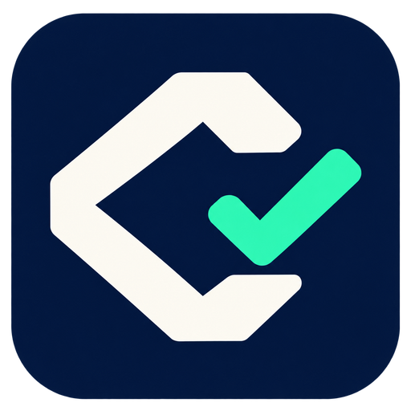

<p align="center"></p>

# Codelean

An open-source, self-hosted GitHub pull request reviewer. Codelean combines Semgrep and Gitleaks with AI reviews, an editable security audit, and a Next.js dashboard. PostgreSQL stores workspaces, the durable queue, review history, and resumable batches.

**Self-hosting does not require a Codelean subscription or Creem account.** You supply your GitHub App, infrastructure, and model API credentials. Hosting and model provider costs are yours. Optional Creem billing is available for operators running a paid service.

Reviews are advisory: Codelean posts findings and checks; it does not approve or merge PRs, install their dependencies, or execute their code. This is an early release; see [architecture and limitations](docs/architecture.md).

## Get started

Requires Node.js 22+, npm, and Docker with Compose v2.

```sh
git clone https://github.com/luodaint/codelean.git
cd codelean
npm ci
npm run setup
```

Setup creates an ignored `.env` with random secrets. For a local preview, set `APP_URL=http://localhost:3100`, `DEV_AUTH_BYPASS=true`, and `BILLING_ENABLED=false`. Then:

```sh
docker compose -p codelean-dev -f compose.yml -f compose.dev.yml up -d --build --wait postgres scanner
npm run migrate
npm run dev -- --hostname 127.0.0.1 --port 3100
# In another terminal:
npm run worker
```

Open [localhost:3100](http://localhost:3100), request an email code, and enter any number in this local-only mode. Create a workspace. Live reviews need GitHub App and model credentials; the full [local walkthrough](docs/getting-started.md) explains login, webhooks, onboarding, and troubleshooting. Never expose development authentication publicly.

## Choose your model provider

Codelean uses the **OpenAI-compatible Chat Completions API**. Configure the URL, API key, and model in `.env`; no source changes are needed. Compatibility requires streaming chat completions, JSON answers, and the request fields described in the [provider guide](docs/llm-providers.md). It does not mean every OpenAI API or every model is supported.

We recommend [NaN](https://nan.builders/) for builders who want access to hosted open models, and [Helmcode](https://helmcode.com/) for teams seeking managed, dedicated, or on-premise inference. See [NaN’s API docs](https://nan.builders/docs) and [Helmcode’s deployment options](https://helmcode.com/product/overview). OpenAI and other compatible providers are also configurable.

```dotenv
# Recommended NaN configuration
LLM_BASE_URL=https://api.nan.builders/v1
LLM_API_KEY=your-provider-key
LLM_MODEL=your-available-model-id
LLM_FALLBACK_MODEL=
BILLING_ENABLED=auto
```

Existing installations can keep their complete `NAN_BASE_URL`, `NAN_API_KEY`, `NAN_MODEL`, and `NAN_FALLBACK_MODEL` configuration. Leave `LLM_*` connection fields empty to use it. Changing providers does not reuse the old provider's key or model.

## Documentation

Start with the [documentation index](docs/README.md), which links every guide and operational brief.

| Task                                                    | Guide                                                                                |
| ------------------------------------------------------- | ------------------------------------------------------------------------------------ |
| Run locally, sign in, create workspaces                 | [Getting started](docs/getting-started.md)                                           |
| Deploy with Docker Compose or Dokploy, back up, upgrade | [Installation and operations](docs/installation.md)                                  |
| Configure an instance                                   | [Environment reference](docs/configuration.md), [.env.example](.env.example)         |
| Use NaN, Helmcode, OpenAI, or another provider          | [LLM providers](docs/llm-providers.md)                                               |
| Prepare a fresh or existing server                      | [Server preparation brief](docs/server-bootstrap.txt)                                |
| Configure DNS, HTTPS, and webhooks                      | [Domain setup](docs/domain-setup.md)                                                 |
| Understand the pipeline and limitations                 | [Architecture](docs/architecture.md), [resumable reviews](docs/resumable-reviews.md) |
| Add a review skill, scanner, or feature                 | [Extending Codelean](docs/extending.md), [review skills](review-skills/README.md)    |
| Operate optional paid billing                           | [Billing](docs/billing.md)                                                           |
| Maintain the public repository                          | [Repository security](docs/repository-security.md)                                   |

## Contribute

[Open an issue](https://github.com/luodaint/codelean/issues) for bugs and feature requests, or fork the repository and submit a pull request. Public visibility does not grant push access. Maintainers review changes before merging.

Read [CONTRIBUTING.md](CONTRIBUTING.md), [SECURITY.md](SECURITY.md), and the repository’s [agent instructions](AGENTS.md). Please report vulnerabilities privately, without putting credentials or private source code into public issues.

```sh
npm run typecheck
npm test
python3 -m unittest discover -s scanner -p 'test_*.py'
npm run build
```

Database integration tests need a **disposable, migrated** `TEST_DATABASE_URL`; they modify fixtures. CI provisions its own PostgreSQL database. External API calls are mocked in tests; live GitHub, provider, and optional payment checks require a designated test installation.

## License

[MIT](LICENSE). Bundled third-party review guidance retains its own license and attribution; see [review skills](review-skills/README.md). The software license does not grant rights to third-party names or trademarks.
