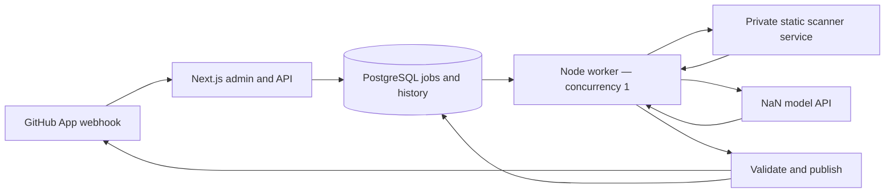

# Codelean · codelean.dev

A self-hosted GitHub PR reviewer with a Next.js admin, PostgreSQL queue, Semgrep/Gitleaks static checks, and AI review through NaN. Designed for a small Dokploy installation on Hetzner.

**v0.1 proof of concept.** The app and Docker deployment run locally. Connecting a real GitHub App and NaN key is required for live reviews. GitHub sign-in needs the App’s client ID and secret; SMTP is optional for email-code fallback. No hosted service or public image registry is assumed.

## What works

- Better Auth GitHub sign-in with verified-email access checks, GitHub profile details and PostgreSQL sessions. Email-code fallback is available; local development can accept any numeric code.
- GitHub App repository discovery, enable/pause controls, signed PR webhooks and durable jobs.
- Bounded source snapshots at an exact commit, static checks, secret redaction, and validated AI findings.
- GitHub check progress, an updated summary comment, up to five inline AI comments, and optional status labels.
- Run history, findings, retry controls, worker status and usage statistics.
- Source-built Docker images, Compose/Dokploy configuration, migrations, health checks, and installation/backup instructions.

Reviews are **advisory**: no auto-approval, requests for changes, merges, dependency installation, or execution of repository test suites in this version. Those need their own policies and a stronger execution sandbox. Existing CI results are not yet aggregated.

## Quick start

Requires Node.js 22+ with npm and a running Docker engine with Compose v2 (for example, Docker Desktop or OrbStack on macOS). Python 3 is only needed to run the scanner unit tests on the host. Clone the private repository with an authorized GitHub account, then run:

```sh
git clone git@github.com:luodaint/codelean.dev.git
cd codelean.dev
npm ci
npm run setup
```

Edit these values in the new `.env`:

```dotenv
APP_URL=http://localhost:3100
ADMIN_EMAILS=you@example.com
DEV_AUTH_BYPASS=true
```

Replace the example email with yours. Setup generates credentials and the local database URL; keep those generated values. If `.env` already exists, skip `npm run setup` and update that file instead. SMTP, GitHub and NaN credentials can remain empty while exploring the admin locally.

```sh
docker compose -p codelean-dev -f compose.yml -f compose.dev.yml up -d --build --wait postgres scanner
npm run migrate
npm run dev -- --hostname 127.0.0.1 --port 3100
```

Open [localhost:3100](http://localhost:3100), enter an allowed email, request a code, then enter any number. No mail is sent in this mode. The bypass requires `next dev` and a loopback `APP_URL`; Docker production deployments force it off.

The development override publishes dependencies only on loopback and permits network egress for host access. Production uses internal networks; never deploy with `compose.dev.yml` on a server.

In another terminal in the same directory, start the worker:

```sh
npm run worker
```

The worker can start without provider credentials and will show as online in the dashboard. Processing actual reviews requires the GitHub and NaN configuration described in the [installation guide](docs/installation.md). Live webhooks require a reachable HTTPS URL; use a dedicated test installation with real email authentication for internet-accessible testing.

### Enable GitHub sign-in on localhost

You can use the **same GitHub App** for login and PR review; no separate OAuth App is needed. Login works on localhost without a public webhook or tunnel.

1. Open [New GitHub App](https://github.com/settings/apps/new), enter a unique name and set **Homepage URL** to `https://codelean.dev` (or your own instance URL).
2. Set **Callback URL** to `http://localhost:3100/api/auth/callback/github`. Leave **Request user authorization (OAuth) during installation** unchecked: Codelean starts the flow with browser-bound state.
3. For login-only testing, uncheck **Webhook → Active**. Under **Account permissions**, set **Email addresses → Read-only**.
4. Select **Only on this account** for a personal test, then create the App. Choose **Any account** when you need installation on other personal accounts or organizations.
5. Copy the **Client ID** (different from the numeric App ID), generate a **Client secret**, and put both in `.env`:

```dotenv
GITHUB_CLIENT_ID=your_client_id
GITHUB_CLIENT_SECRET=your_client_secret
ADMIN_EMAILS=your_verified_github_email
```

6. Run `npm run migrate` to add the GitHub profile fields, restart the Next.js dev server, sign out if necessary, and click **Continue with GitHub**. SMTP is not required. For production, use your HTTPS origin in both `APP_URL` and the callback URL.

At least one verified email returned by GitHub must match `ADMIN_EMAILS`. A verified matching email-code account is linked to the GitHub identity. Profile name, username, numeric GitHub ID and avatar are saved; OAuth tokens are encrypted server-side. Browser state and PKCE are handled by Better Auth.

This identifies the user; it does **not** install the App or make the admin multi-tenant. Every allowed administrator still sees the same workspace. For PR review permissions, private key and webhook setup, follow [the installation guide](docs/installation.md#4-register-the-github-app). GitHub cannot send webhooks directly to localhost; PR-event testing needs a reachable webhook forwarder or a test deployment. Never expose the development login bypass publicly.

If GitHub reports an email/authorization error, verify the App's **Email addresses** permission and your email allowlist. If GitHub reports a redirect mismatch, check the exact callback origin, port and path. See [Better Auth's GitHub setup](https://better-auth.com/docs/authentication/github) and [GitHub's sign-in guide](https://docs.github.com/en/apps/creating-github-apps/writing-code-for-a-github-app/building-a-login-with-github-button-with-a-github-app).

### Check, stop and restart locally

```sh
curl --fail http://localhost:3100/api/health
curl --fail http://localhost:18080/health
docker compose -p codelean-dev -f compose.yml -f compose.dev.yml ps
```

Both health endpoints should return `{"status":"ready"}`. GitHub and NaN configuration is checked when used, not by these health endpoints.

Stop Next.js and the worker with `Ctrl+C` in their terminals, then stop Docker dependencies:

```sh
docker compose -p codelean-dev -f compose.yml -f compose.dev.yml stop
```

To resume, repeat the Compose `up` command, `npm run migrate`, and the web/worker commands above. PostgreSQL data persists in a named Docker volume. Do not use `down -v` unless you intend to delete that local database. Restart the worker after changing `.env`.

### Local troubleshooting

- **Port already in use:** the defaults are web `3100`, PostgreSQL `55439` and scanner `18080`. Stop your previous development instance, or set `DEV_DATABASE_PORT`/`DEV_SCANNER_PORT` in `.env` and update `DATABASE_URL`/`SCANNER_URL` to match. A different web port also needs a matching `APP_URL` and `--port` argument.
- **Database connection refused:** verify Docker is running and PostgreSQL is healthy before migrations. Check that `DATABASE_URL` matches the configured port and credentials. Changing `POSTGRES_PASSWORD` does not change the password inside an existing database volume.
- **Email not authorized:** the email must appear in `ADMIN_EMAILS`. Local numeric sign-in still requires requesting a code first; no actual email is sent.
- **Local code rejected:** run `npm run dev`, use a loopback `APP_URL`, and set `DEV_AUTH_BYPASS=true`. A production build or Compose web container requires GitHub sign-in or a real emailed code.
- **Worker offline:** run `npm run worker` in a second terminal. Only one worker can hold the database lock; stop an older worker before starting another.
- **Scanner still starting:** the first image build downloads the scanner dependencies and can take several minutes. Check its scoped logs with `docker compose -p codelean-dev -f compose.yml -f compose.dev.yml logs --tail 50 scanner`.

## Deployment and operation

- [codelean.dev, Cloudflare DNS, local webhook tunnel and rename notes](docs/domain-setup.md)
- [Installation, configuration, GitHub setup, backups and upgrades](docs/installation.md)
- [Standalone Codex/Claude server preparation brief](docs/server-bootstrap.txt)
- [Architecture and current boundaries](docs/architecture.md)

Use the existing Dokploy host first, with one review at a time. No cluster is needed. The scanner has a 2 GiB memory cap; assess headroom alongside existing applications before deployment.

## Architecture



PostgreSQL also provides the queue and worker lock, so Redis is unnecessary for this milestone. Scanners run in a non-root, restricted container with a private network, fixed commands and temporary source directories. They receive no GitHub or NaN credentials. This is process/container isolation on a shared kernel, not a VM sandbox or a disposable container for every run.

## Validation

```sh
npm run typecheck
npm test
python3 -m unittest discover -s scanner -p 'test_*.py'
npm run build
```

The database/auth/publication suites run only with `TEST_DATABASE_URL` set to a **disposable, migrated database**. They create and delete fixtures. CI provisions its own PostgreSQL instance. Real SMTP delivery and GitHub/NaN round trips need operator credentials and a designated test PR.
